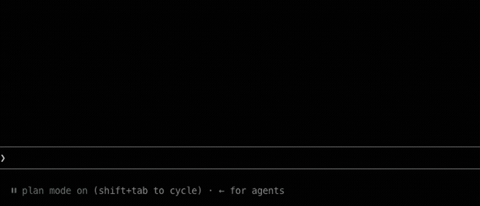

# plan-mode-always-approve

> For anyone who wants plan mode's harness but can't be bothered with the approval step.



Instantly approves the "Would you like to proceed?" prompt that comes up when a plan is ready, and moves on in auto mode.

## Install

```bash
claude plugin marketplace add LeeShinYeoung/claude-plan-mode-always-approve
claude plugin install plan-mode-always-approve@plan-mode-always-approve
```

## Usage

Installing it doesn't turn anything on. Run the commands below from a session in the target project to turn auto-approval on and off. They apply per project only, not globally.

```
/plan-mode-always-approve:on    # turn auto-approval on
/plan-mode-always-approve:off   # turn auto-approval off
```

Which projects are on is kept in your home directory, in `~/.claude/plan-mode-always-approve`, one project path per line. Nothing is written into the project itself, so there is no new file to commit and nothing to add to `.gitignore`.
